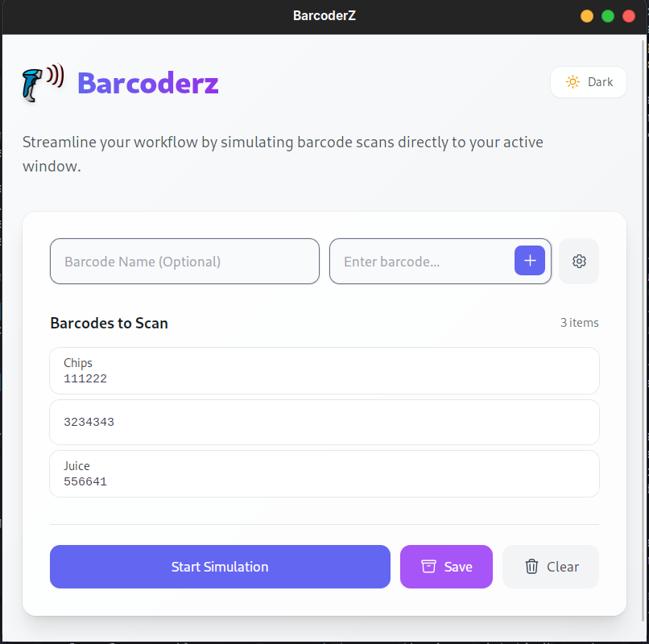

# Barcoderz 🚀

Barcoderz is a powerful and intuitive cross-platform desktop application designed to simulate barcode scanning. It allows users to create a list of barcodes, name them for better organization, and simulate the scanning process directly into any active text field or application.



## ✨ Features

- **Barcode Simulation:** Automatically types barcode sequences into your active window.
- **Custom Naming:** Assign descriptive names to each barcode for easy identification.
- **Real-time Progress:** Visual loading indicators show exactly which barcode is currently being "scanned".
- **Adjustable Timing:** Configure initial delays and gaps between scans to match your system's speed.
- **Persistent Storage:** Your barcode list and theme preferences are saved locally.
- **Cross-Platform:** Support for Linux (.deb, .rpm) and Windows (.exe).
- **Dark Mode:** Elegant UI with support for both Light and Dark themes.

## 📚 Documentation & Resources

For more information on the underlying technology, refer to the official documentation:
- **Tauri v2 Documentation:** [https://v2.tauri.app/](https://v2.tauri.app/)
- **Tauri Prerequisites:** [https://v2.tauri.app/start/prerequisites/](https://v2.tauri.app/start/prerequisites/)

## 🛠️ Prerequisites & Setup

Before running the project, ensure your development environment is set up correctly.

### System Dependencies

#### Linux (Ubuntu/Debian)
You need the standard Tauri build dependencies plus `libxdo-dev` for the barcode simulation feature:
```bash
sudo apt-get update
sudo apt-get install libwebkit2gtk-4.1-dev build-essential curl wget file libssl-dev libgtk-3-dev libayatana-appindicator3-dev librsvg2-dev libxdo-dev
```

#### Windows
- Install [Microsoft Visual Studio C++ Build Tools](https://visualstudio.microsoft.com/visual-cpp-build-tools/).

#### macOS
- Install Xcode Command Line Tools: `xcode-select --install`

### Application Setup

1. **Clone the repository:**
   ```bash
   git clone https://github.com/your-username/barcoderz.git
   cd barcoderz
   ```

2. **Install dependencies:**
   ```bash
   pnpm install
   # OR
   npm install
   ```

3. **Run in development mode:**
   ```bash
   pnpm tauri dev
   # OR
   npm run tauri dev
   ```

4. **Build for production:**
   ```bash
   pnpm tauri build
   ```

## 🐧 Linux Troubleshooting

### Wayland Display Issues
If you are running on Linux with **Wayland** and the application window appears blank, translucent, or flickers, you can force WebKit to disable compositing mode. This environment variable works with both the dev server (npm/pnpm) and the final binary.

**Development Mode:**
```bash
WEBKIT_DISABLE_COMPOSITING_MODE=1 pnpm tauri dev
# OR
WEBKIT_DISABLE_COMPOSITING_MODE=1 npm run tauri dev
```

**Production Binary:**
```bash
WEBKIT_DISABLE_COMPOSITING_MODE=1 ./src-tauri/target/release/barcoderz
```

### Input Simulation
On Linux, the application requires `libxdo` to simulate keystrokes. If the app runs but doesn't type anything:
- **Ubuntu/Debian:** `sudo apt-get install libxdo-dev`
- **Fedora:** `sudo dnf install libxdo-devel`
- **Arch:** `sudo pacman -S xdotool`

## 🚀 CI/CD Pipeline

This project includes a GitHub Actions workflow that automatically builds and creates releases.
- **Trigger:** Push to the `main` branch.
- **Artifacts:** Generates `.deb`, `.rpm` (Linux) and `.exe` (Windows) installers.
- **Releases:** Automatically published to the GitHub "Releases" section of your repository.

## 📄 License

This project is licensed under the MIT License - see the LICENSE file for details.
